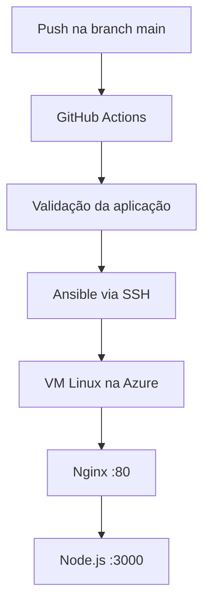

# Pipeline CI/CD para Node.js na Azure

Projeto desenvolvido para praticar um fluxo completo de infraestrutura e entrega contínua. A infraestrutura é provisionada com Terraform, o servidor é configurado com Ansible e o deploy da aplicação Node.js é automatizado pelo GitHub Actions.

## Arquitetura



O Nginx recebe as requisições HTTP na porta `80` e atua como proxy reverso para o serviço Node.js, que escuta somente em `127.0.0.1:3000`. A aplicação é executada por um serviço `systemd` com um usuário próprio e sem acesso interativo ao shell.

## Tecnologias utilizadas

- Node.js 24 e Express;
- Nginx como proxy reverso;
- systemd para gerenciamento do serviço;
- Terraform e provider AzureRM;
- Ansible e coleção `community.general`;
- GitHub Actions;
- Azure Virtual Machine;
- SSH.

## Estrutura do projeto

```text
.
├── .github/workflows/     # Pipeline de CI/CD
├── ansible/               # Playbook, roles e dependências do Ansible
│   └── roles/
│       ├── app/           # Deploy e serviço systemd
│       ├── nginx/         # Proxy reverso
│       └── nodejs/        # Instalação do Node.js
├── app/                   # Aplicação Node.js
└── terraform/             # Infraestrutura da Azure
```

## Fluxo do pipeline

O workflow é executado em cada `push` para a branch `main` e também pode ser iniciado manualmente.

### Integração contínua

1. Faz checkout do repositório;
2. configura o Node.js 24;
3. instala as dependências com `npm ci`;
4. verifica a sintaxe do servidor;
5. inicia a aplicação temporariamente;
6. executa um teste HTTP local com `curl`.

### Entrega contínua

Após a validação:

1. configura Python e Ansible no runner;
2. prepara a chave e o arquivo `known_hosts` usando GitHub Secrets;
3. gera um inventário temporário;
4. executa a role `app` na VM via SSH;
5. publica exatamente o commit que disparou o workflow;
6. testa a aplicação pelo endereço público através do Nginx.

## Pré-requisitos

- uma assinatura ativa da Azure;
- Azure CLI autenticada;
- Terraform `>= 1.15.0` e `< 2.0.0`;
- Ansible Core 2.21.3 para execução local;
- uma chave SSH;
- Git.

## Provisionamento com Terraform

Entre no diretório:

```bash
cd terraform
```

Crie um arquivo `terraform.tfvars`:

```hcl
subscription_id = "ID_DA_ASSINATURA_AZURE"
```

O arquivo `terraform.tfvars` é ignorado pelo Git e não deve ser versionado.

Inicialize e valide a infraestrutura:

```bash
terraform init
terraform fmt -check
terraform validate
terraform plan
```

Crie os recursos:

```bash
terraform apply
```

Ao final, o Terraform apresenta o IP público da VM no output `public_ip_address`.

Para remover toda a infraestrutura criada:

```bash
terraform destroy
```

## Configuração inicial com Ansible

Instale as collections necessárias:

```bash
ansible-galaxy collection install -r ansible/requirements.yml
```

Crie `ansible/inventory.ini`:

```ini
[servers]
IP_DA_VM ansible_user=USUARIO_DA_VM ansible_ssh_private_key_file=CAMINHO_DA_CHAVE
```

Teste a conexão:

```bash
ansible all -i ansible/inventory.ini -m ansible.builtin.ping
```

Execute o bootstrap completo do servidor:

```bash
ansible-playbook -i ansible/inventory.ini ansible/setup.yml
```

As roles também podem ser executadas separadamente:

```bash
ansible-playbook -i ansible/inventory.ini ansible/setup.yml --tags nodejs
ansible-playbook -i ansible/inventory.ini ansible/setup.yml --tags nginx
ansible-playbook -i ansible/inventory.ini ansible/setup.yml --tags app
```

## Configuração do GitHub Actions

Configure em **Settings → Secrets and variables → Actions**.

### Variables

| Nome | Conteúdo |
|---|---|
| `SERVER_HOST` | IP público da VM |
| `SERVER_USER` | Usuário SSH da VM |

### Secrets

| Nome | Conteúdo |
|---|---|
| `SSH_PRIVATE_KEY` | Chave privada usada exclusivamente pelo pipeline |
| `SSH_KNOWN_HOSTS` | Identidade SSH conhecida do servidor |

Nenhuma chave privada, arquivo de estado do Terraform ou inventário real deve ser enviado ao repositório.

## Testando a aplicação

Depois do deploy:

```bash
curl http://IP_DA_VM/
```

Resposta esperada:

```text
Hello World!
```

Para conferir o serviço diretamente na VM:

```bash
sudo systemctl status node-service
sudo journalctl -u node-service --no-pager
```

## Medidas de segurança aplicadas

- autenticação SSH por chave;
- aplicação executada com usuário de sistema dedicado;
- Node.js acessível somente pela interface local;
- Nginx como único ponto público da aplicação;
- remoção do header `X-Powered-By` do Express;
- ocultação da versão do Nginx;
- secrets armazenados no GitHub Actions;
- arquivos sensíveis ignorados pelo Git.

Este é um ambiente de laboratório. Em produção, ainda seria necessário restringir a origem permitida na porta SSH, configurar HTTPS, aplicar atualizações de segurança e definir uma estratégia de monitoramento e backup.

## Commits sem executar o pipeline

Alterações exclusivas de documentação podem usar uma instrução de skip:

```bash
git commit -m "docs: update project documentation [skip ci]"
```

## Objetivo do projeto

O projeto integra os principais blocos de um fluxo DevOps básico: infraestrutura como código, gerenciamento de configuração, execução de serviços Linux, proxy reverso, gerenciamento de secrets e deploy automatizado com validação antes da publicação.
